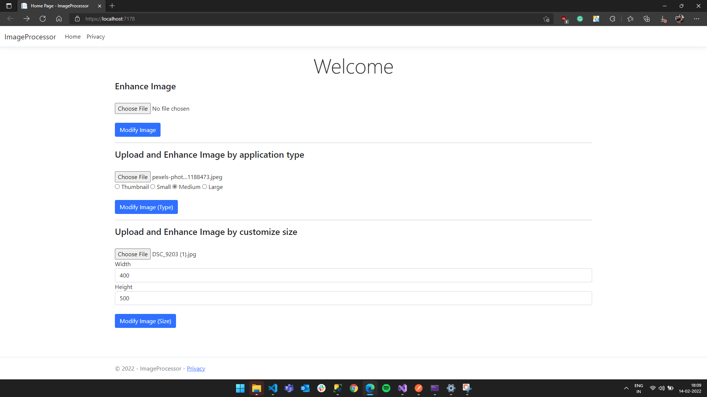

# Image Processor
>A solution for image processing , storage and provisioning in the docker environment. Uploaded photos will be enhanced, persisted and made available in different resolution through an .NET Core app.

## Table of Contents
* [Technologies Used](#technologies-used)
* [Features](#features)
* [Screenshots](#screenshots)
* [Project Status](#project-status)
* [Room for Improvement](#room-for-improvement)
* [Contact](#contact)

## Technologies Used
- .NET Core
- Swagger
- SQL Local Database

## Features
List the ready features here:
- Apis and DB is dockerized and ready to used as a container image
- Apis are writeen in .NET Core and documented using swagger endpoint for better readability and documentation.
- It has endpoint for uploading and retrieving photos and their metadata
- Data is stored with sql database and photos are also persisted in the file system.
- Photos can we resized according to customized resolution.
- API also provide endpoint for retrieving images according to different application  (e.g. /thumbnail -> 128px, /small -> 512px, /large -> 2048px).
- All the photos uploaded to the APIs are automatically enhanced (i.e. Brightness , Contrast etc.)

## Screenshots
.png)
.png)

## Project Status
Project is: _complete_ . Open for betterment.

## Room for Improvement

Room for improvement:
- Some advance features can also be added (i.e. Image rotation, Image Flip etc).
-  User can be provided to adjust the brightness from the front end.

## Acknowledgements
Give credit here.
- This project was inspired by IIASA NODES - Full Stack Challenge.

## Contact
Created by [@anuraadha](https://www.linkedin.com/in/anuradha-dhaked/) - feel free to contact me!

